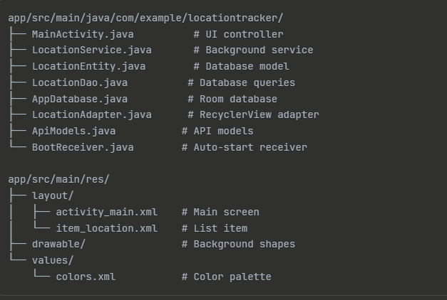

# 📍 Android Location Tracker

A simple Android application that demonstrates **background location tracking**, **local data persistence**, and **REST API integration** using modern Android development practices.

---

## 🖼️ UI Preview

<table>
  <tr>
    <td align="center">
      
      <br/>
      <b>Home Screen</b>
    </td>
    <td align="center">
      
      <br/>
      <b>Location History</b>
    </td>
  </tr>
</table>

> 📌 Screenshots taken from a real Android device.

## ✨ Features

- **Background Location Tracking**
  - Location updates every 5 minutes
  - Runs as a foreground service
  - Continues after app closure and device reboot
  - Displays updates via Toast messages

- **Local Database Storage**
  - Room (SQLite) database
  - Stores latitude, longitude, and timestamp
  - Displays location history using RecyclerView

- **API Integration**
  - Fetches data from JSONPlaceholder API
  - Uses Retrofit + GSON
  - Handles network errors gracefully

---

## 🛠 Tech Stack

- **Language:** Java  
- **UI:** XML (Material Design 3)  
- **Database:** Room (SQLite)  
- **Location Services:** Google Play Services  
- **Networking:** Retrofit + GSON  
- **Architecture:** MVVM-inspired  

---
## 🛠 Project Structure
|  |

## 🚀 Getting Started

### Prerequisites
- Android Studio (2023.1+ recommended)
- JDK 11+
- Android SDK (API 24–34)
- Physical device or emulator with Google Play Services

---

### Installation

```bash
git clone  https://github.com/robiulislam99/LocationTrackerApp.git
